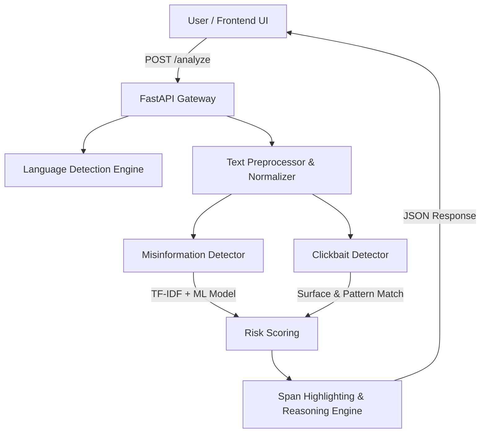

<div align="center">

# 🛡️ VeritasNLP
### Multilingual Misinformation & Clickbait Detection Engine

[](https://fastapi.tiangolo.com/)
[](https://python.org)
[](https://scikit-learn.org/)
[](https://vercel.com/)
[](LICENSE)

*An end-to-end, production-ready AI engine that detects fake news, deceptive claims, and clickbait headlines across **12+ global languages** using Machine Learning, Natural Language Processing (NLP), and surface feature heuristics.*

---

</div>

## 🌟 Key Features

- 🌐 **Multilingual Auto-Detection**: Automatically detects input languages (English, Hindi, French, Spanish, German, Arabic, Bengali, Tamil, etc.) or accepts manual overrides.
- 🤖 **Hybrid Detection Model**:
  - **TF-IDF + Machine Learning**: Logistic Regression / Gradient Boosting classifiers trained on cross-lingual pattern sets.
  - **Heuristic Rule Engine**: Fallback scoring mechanism ensuring zero-downtime reliability even before model training.
- 🎯 **Clickbait & Red-Flag Identification**: Detects sensationist headlines, exaggerated punctuation, emotional triggers, and misleading claims.
- 📄 **Real-time Span Highlighting**: Highlights specific suspicious phrases and clickbait triggers directly in the original text.
- 📊 **Confidence & Risk Dashboard**: Visual confidence rings, score bars, and verdict status (`Reliable`, `Suspicious`, `High Risk`).
- ⚡ **Lightning Fast FastAPI Backend**: Asynchronous response processing in under 50ms.
- 💎 **Modern Dark UI**: Designed with glassmorphism, fluid typography (`Space Grotesk` & `Inter`), dynamic animations, and quick sample chips.

---

## 🏗️ Architecture Overview



---

## 🌐 Supported Languages

| Flag | Language | ISO Code | Mode |
| :---: | :--- | :---: | :---: |
| 🇺🇸 | English | `en` | ML / Heuristic |
| 🇮🇳 | Hindi (हिंदी) | `hi` | ML / Heuristic |
| 🇫🇷 | French (Français) | `fr` | ML / Heuristic |
| 🇪🇸 | Spanish (Español) | `es` | ML / Heuristic |
| 🇩🇪 | German (Deutsch) | `de` | ML / Heuristic |
| 🇸🇦 | Arabic (العربية) | `ar` | ML / Heuristic (RTL) |
| 🇮🇳 | Bengali (বাংলা) | `bn` | ML / Heuristic |
| 🇮🇳 | Tamil (தமிழ்) | `ta` | ML / Heuristic |
| ... | *+ 4 more languages* | | |

---

## 🚀 Quick Start (Local Setup)

### 1. Prerequisites
- **Python 3.10+** installed on your system.

### 2. Clone repository & Setup Backend
```bash
git clone https://github.com/JainNaman5/Multi_Misinfo_detect.git
cd Multi_Misinfo_detect/backend

# Create virtual environment (optional)
python -m venv venv
# On Windows:
.\venv\Scripts\activate
# On Mac/Linux:
source venv/bin/activate

# Install dependencies
pip install -r requirements.txt
```

### 3. Train ML Models (Optional)
```bash
python train.py
```

### 4. Run API Server
```bash
uvicorn app:app --reload --host 0.0.0.0 --port 8000
```
> API will run at: `http://localhost:8000`  
> Swagger Documentation: `http://localhost:8000/docs`

### 5. Launch Frontend
Open a new terminal window:
```bash
cd Multi_Misinfo_detect/frontend
python -m http.server 3000
```
Navigate to **[http://localhost:3000](http://localhost:3000)** in your web browser.

---

## ☁️ Deployment to Vercel

VeritasNLP is pre-configured with `vercel.json` for one-click deployment of both the FastAPI backend serverless functions and the static web frontend.

### Option 1: Deploying via Vercel CLI

1. Install Vercel CLI globally:
   ```bash
   npm install -g vercel
   ```
2. Log in to Vercel:
   ```bash
   vercel login
   ```
3. Deploy from the root folder:
   ```bash
   vercel --prod
   ```

### Option 2: Deploying via GitHub & Vercel Dashboard

1. Push your repository to **GitHub**:
   ```bash
   git add .
   git commit -m "Deploy to Vercel"
   git push origin main
   ```
2. Go to **[vercel.com/new](https://vercel.com/new)**.
3. Import your GitHub repository (`Multi_Misinfo_detect`).
4. Click **Deploy**. Vercel automatically detects `vercel.json` and configures the FastAPI serverless functions & static frontend automatically.

---

## 📡 API Reference

### `POST /analyze`
Analyzes input text for misinformation risk, clickbait triggers, and detected language.

**Request Body:**
```json
{
  "text": "SHOCKING: Scientists prove 5G towers cause memory loss — doctors hate this secret!",
  "language_override": null
}
```

**Response Output:**
```json
{
  "text_preview": "SHOCKING: Scientists prove 5G towers cause memory loss...",
  "language": {
    "code": "en",
    "name": "English",
    "flag": "🇺🇸",
    "confidence": 0.99
  },
  "misinformation": {
    "label": "Fake / High Risk",
    "risk_score": 0.85,
    "confidence": 0.92,
    "reasoning": ["High concentration of sensationalism", "Unverifiable conspiracy claim"]
  },
  "clickbait": {
    "is_clickbait": true,
    "label": "Clickbait Triggered",
    "score": 0.88
  },
  "overall": {
    "verdict": "High Risk",
    "color": "danger",
    "risk_score": 0.86
  },
  "processing_time_ms": 14.2
}
```

---

## 🛠️ Tech Stack

- **Backend**: FastAPI, Uvicorn, Pydantic, Scikit-Learn, Pandas, NumPy, Langdetect
- **Frontend**: HTML5, Vanilla CSS3 (Custom Design System with CSS Variables), JavaScript (ES6+), Lucide Icons, Google Fonts
- **Deployment**: Vercel Serverless Functions (`@vercel/python`)

---

<div align="center">

Developed with ❤️ for Major Project.

</div>
